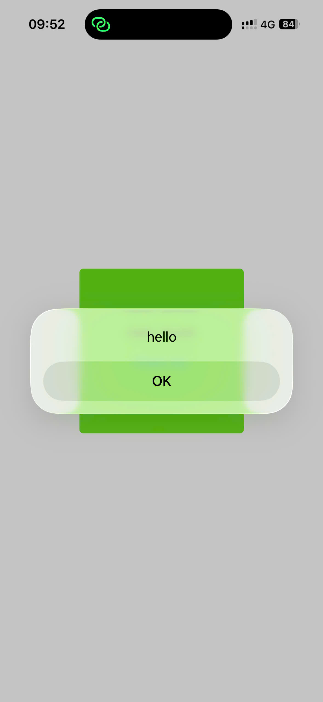
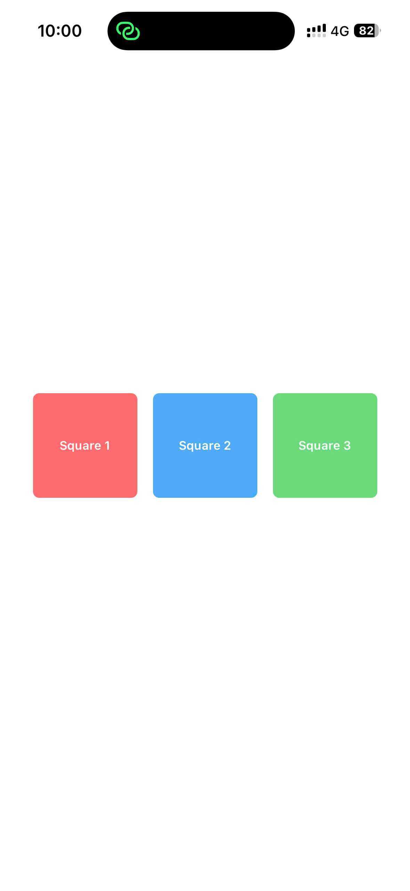
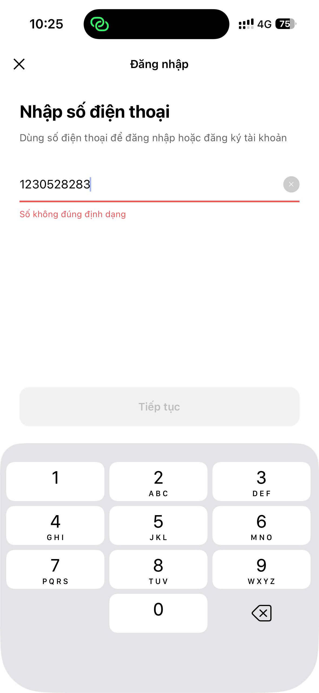
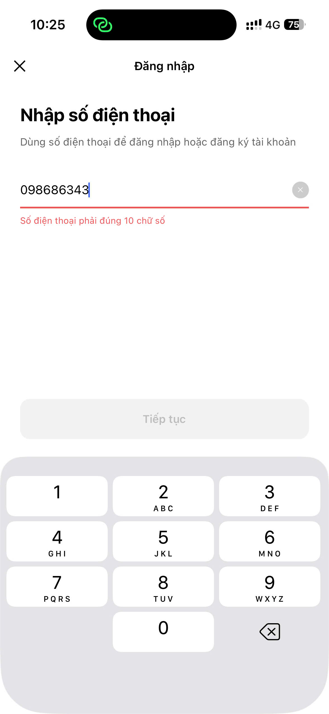
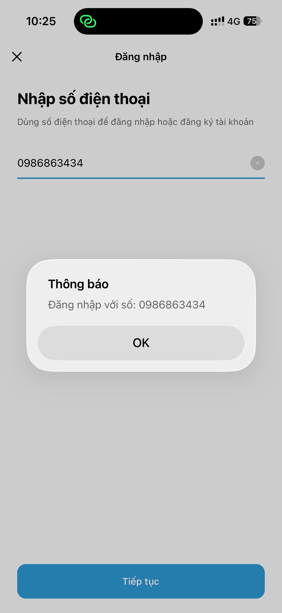

# Tổng hợp bài ảnh và code chạy các bài tập LT MOBILE
## Thông tin sinh viên
- Họ tên: Nguyễn Thế Hiệp
- MSSV: 23810310252
- Lớp: D18CNPM4

## Kết quả chạy

| Bài tập | Ảnh 1 | Ảnh 2 | Ảnh 3 |
|--------|-------|-------|-------|
| Bài tập Core Components – Buổi 2.1 |  |  |  |
| Bài tập Core Components – Buổi 2.2 |  |  |  |
| Bài tập 03.1: Custom Component |  |  |  |
| Bài tập 03.2: FlatList |  |  |  |
| Bài tập 04: Capturing Taps |  |  |  |
| Bài tập 4.2: Styling |  |  |  |
| **BT02: Hoàn thiện Core Components cuối buổi 2** |  |  |  |
